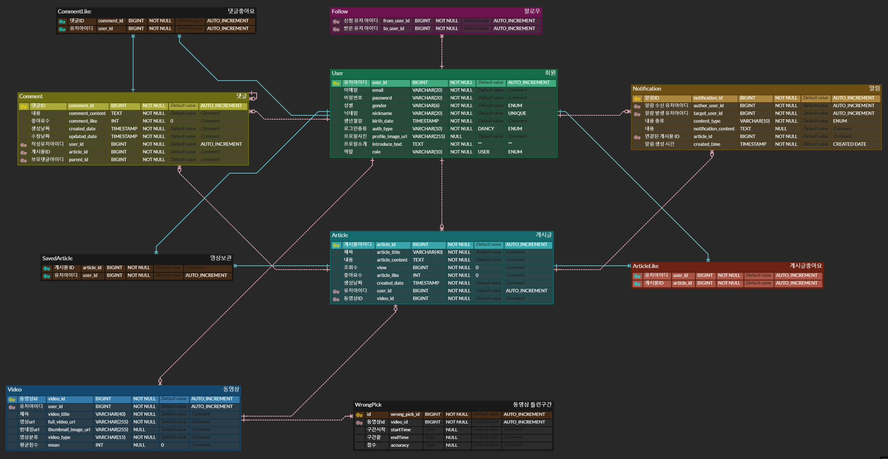

# Dancy - 춤 연습 보조 SNS 서비스

<div align="center">
  <br />
  
  <br />
</div>

## 목차
- [서비스 개요](#서비스-개요)
- [팀원소개](#팀원소개)
- [기술스택](#기술스택)
- [시스템 아키텍처](#시스템-아키텍처)
- [기능소개](#기능소개)
- [프로젝트 산출물](#프로젝트-산출물)


## 서비스 개요
```
'누구나 어디서든'
춤 연습을 할 수 있는 서비스
Dancy로 어서와 ~~ 💃🕺
```


## 팀원소개
<div align="middle">
<table>
    <tr>
        <td height="140px" align="center"> <a href="https://github.com/whalesBob">
             <br><br> 👑 남동우 <br>(Back-End) </a> <br></td>
        <td height="140px" align="center"> <a href="https://github.com/GEISHAz">
             <br><br> 🎮 정민호 <br>(Back-End) </a> <br></td>
        <td height="140px" align="center"> <a href="https://github.com/cnh12">
             <br><br> 🐰 조남현 <br>(Back-End) </a> <br></td>
        <td height="140px" align="center"> <a href="https://github.com/kangjungsuu">
             <br><br> ⚽ 강정수 <br>(Front-End) </a> <br></td>
        <td height="140px" align="center"> <a href="https://github.com/sunoftwilight">
             <br><br> 💎 이해진 <br>(Front-End) </a> <br></td>
        <td height="140px" align="center"> <a href="https://github.com/seolyeonpark">
             <br><br> 🥨 박설연 <br>(Front-End) </a> <br></td>
    </tr>
</table>
</div>


## 기술스택

### 프론트엔드

<div align="middle">


**Language |** Javascript(Node: 18.19.0)

**Framework |** React 18.2.0

**Library |** Axios 1.6.7, Styled Components 6.1.8, Recoil 0.7.7, Yarn 1.22.21, EventSourcePolyfill 1.0.31

<br>
<br>

</div>


### 백엔드

<div align="middle">

 


**Language |** Java 17

**Framework |** Spring Boot 3.2.2

**Data(RDBMS) |** Spring Data JPA

**Build Tool |** Gradle 8.5.0

**Library |** MediaPipe

</div>

<br>
<br>

### 인프라

<div align="middle">


**DB |** MariaDB 10.11 LTS

**Server |** GitLab, Jenkins, Docker, Nginx

</div>

<br>
<br>

## 시스템 아키텍처
<div align="middle">
  <br />
  
  <br />
</div>

<br>
<br>

## 기능소개

🧡 메인 페이지


<br>
<br>

💛 영상 변환 페이지


- 안무 영상과 나의 영상을 첨부하고 변환 버튼을 클릭하면 상단 헤더에 로딩이 시작됩니다.
- 안무 영상은 서비스에서 제공하는 가이드라인 영상을 선택하거나, 본인이 원하는 안무 영상을 첨부할 수 있습니다.

<br>
<br>

💚 PRACTICE 페이지


- 구간 반복을 통해서 정확도가 떨어지는 안무를 연습할 수 있습니다.
- 연속 재생을 통해서 전체 영상을 반복해서 연습할 수 있습니다.
- 열심히 연습한 안무영상을 게시할 수 있습니다.
<br>
<br>


💙 STAGE 페이지


- 유저들이 업로드한 영상들을 한눈에 볼 수 있습니다.
<br>
<br>

🤎 영상 상세 페이지


- STAGE 페이지에서 영상을 클릭하면 이동하는 페이지입니다.
- 원하는 영상을 보관하고 좋아요를 누를 수 있습니다.
- 유저들과 댓글을 통해 소통할 수 있습니다.
<br>
<br>

💜 PROFILE 페이지


- 유저가 업로드한 영상과 보관한 영상을 조회할 수 있습니다.
- 다른 유저들을 팔로우 할 수 있습니다.
<br>
<br>


🖤 검색 결과 페이지


- 제목과 닉네임을 기준으로 검색한 영상들을 조회할 수 있습니다.
<br>
<br>

## 프로젝트 산출물

- API 명세서

> https://www.notion.so/API-a481909030e84aedb5ef9d27b407e68a?pvs=4

<br>
<br>

- ERD
<div align="middle">
  <br />
  
  <br />
</div>
<br>
<br>

- 와이어프레임

> https://www.figma.com/file/H3b5XPTkYYCEY0vn283EsU/%EC%B5%9C%EA%B0%95D210%ED%94%BC%EA%B7%B8%EB%A7%88-(Copy)?type=design&node-id=2%3A2&mode=design&t=4V5T39w1D0HACvVE-1

<br>
<br>

- 컨벤션

{width="600"}
{width="600"}
<br>
<br>
- 포팅매뉴얼

>[포팅매뉴얼](./exec/D210.docx)
